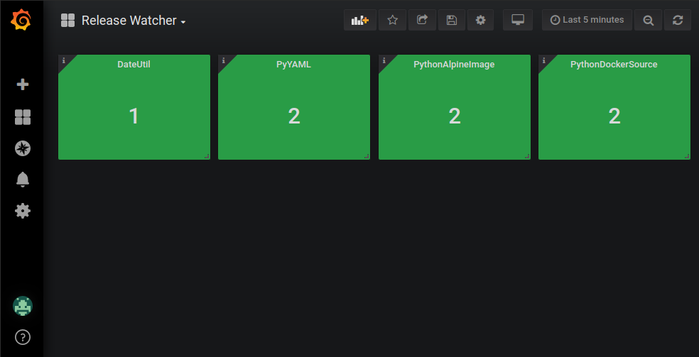

# Grafana

If you are using one of the Prometheus outputs and have a Grafana instance to display those metrics, you might be interested in the following examples.

## Dashboard

`release_watcher_dashboard.json` contains an example of how you can build a dashboard to display the number of missed releases.

